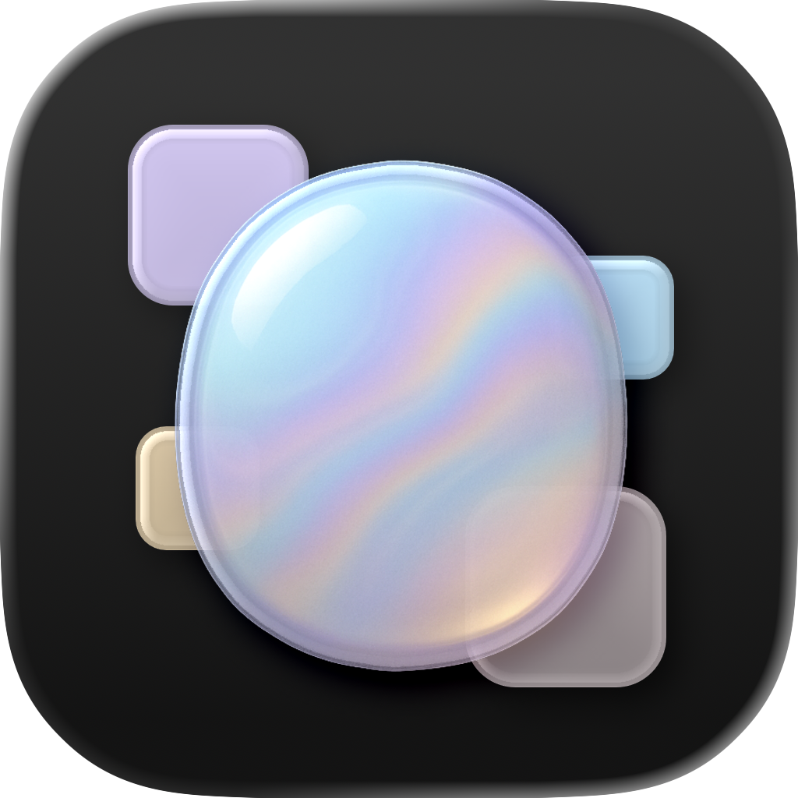

# Opalite

A native color management and digital design app for Apple platforms, by Molargik Software LLC.

## Overview

Opalite helps designers, artists, and developers capture, organize, and share color. It pairs six precise color-picking modes with palette organization, WCAG contrast checking, color-vision simulation, a PencilKit canvas, multi-format export, and a CloudKit-backed Community. Built with SwiftUI and SwiftData, it syncs through iCloud across iPhone, iPad, Mac, Apple TV, Apple Watch, and Apple Vision Pro.

## Features

### Color
- **Six picker modes**: spectrum, grid, shuffle, channels, codes, and image sampling (photos, camera, and the system eyedropper on Mac)
- **Detail**: hex/RGB/HSL/CMYK codes, harmonies, tints & shades, WCAG contrast checker, Apple Intelligence name suggestions
- **Accessibility**: protanopia, deuteranopia, tritanopia, and achromatopsia simulation across the whole app

### Palettes & Canvas
- Drag-and-drop between palettes, manual ordering, archiving, preview backgrounds, and tags
- PencilKit canvas with shapes, placed images, Apple Pencil hover, and a swatch strip (one canvas free, unlimited with Onyx)

### Share
- Export colors and palettes as Opalite files, PNG, PDF, Adobe ASE, Procreate swatches, GIMP palettes, CSS, or SwiftUI code
- Publish to the Community, browse and search others' work, save to your Portfolio (Onyx)
- Quick Look previews and thumbnails for `.opalitecolor` / `.opalitepalette`, an iMessage app, and a Share Extension that samples colors from any image

### Everywhere
- SwatchBar: a slim secondary window for copying hex codes and picking canvas ink on iPad, Mac, and visionOS
- Siri & Shortcuts (show, create, copy, random color, summary), Spotlight indexing, Home Screen quick actions, home-screen widgets, a watch complication, and an immersive color constellation on visionOS

## Requirements

- Xcode 27, Swift 6.4
- iOS/iPadOS 18.4, tvOS 18.4, watchOS 10, visionOS 26.2 (Mac via Catalyst)
- An Apple Developer account for iCloud, CloudKit, and App Groups

## Setup

1. Clone the repository.
2. Open `Opalite.xcworkspace` (it resolves the local `Packages/Opalite` package).
3. Configure signing; keep the bundle identifiers, iCloud container, and App Groups, or update them consistently in the entitlements and `AppGroup.swift`.
4. Build the `Opalite` scheme (iPhone/iPad/Mac/visionOS) or `OpaliteTV`.

Package-only iteration (no simulator needed):

```bash
cd Packages/Opalite && swift build && swift test
```

## Architecture

Opalite is a thin set of app and extension targets over the `Packages/Opalite` umbrella package:

| Module | Responsibility |
|---|---|
| `OpaliteCore` | Pure domain: SwiftData models, color math, harmonies, simulation, exporters, file codec, deep links, repository and use-case protocols, change stream, seams |
| `OpaliteData` | SwiftData store with CloudKit → local → in-memory degradation; repository implementations |
| `OpaliteServices` | CloudKit sync and Community, StoreKit, WatchConnectivity relay, export/PDF rendering, Foundation Models naming, screen sampling |
| `OpaliteDesignSystem` | Brand colors and tokens, Liquid Glass helpers, toast, shared components, localized enum titles |
| `OpaliteFeatureShared` | Environment-injected models (`PortfolioModel`, `CanvasModel`, `CommunityModel`, `HexCopyModel`, `ImportModel`), `SwatchView`/`SwatchRow`, preview environment |
| `OpaliteFeature*` | One module per screen: Portfolio, Search, ColorEditor, Sharing, Community, Canvas, Settings, SwatchBar, Onboarding, Immersive (visionOS), TV (tvOS) |
| `OpaliteComposition` | `SessionController` (composition root), `RootView`, `MainView`, SwatchBar and TV hosts |

Dependencies point inward; features never touch persistence directly. See `CLAUDE.md` for the full map, conventions, and gotchas.

## Localization

English, Spanish, Canadian French, and Japanese via string catalogs. The app target's `Localizable.xcstrings` is the master (plus `InfoPlist.xcstrings` and `AppShortcuts.xcstrings`); `Scripts/extract_package_strings.py` lists package strings as catalog keys, `Scripts/merge_translations.py` merges translations, `Scripts/pin_package_strings.py` pins them, and `Scripts/sync_target_catalogs.py` derives the TV, watch, widget, and extension catalogs from the master.

## Privacy

All portfolio data lives in your private iCloud container. Community content is published only when you choose to. No analytics or tracking.

## License

MIT — see [LICENSE](LICENSE).
